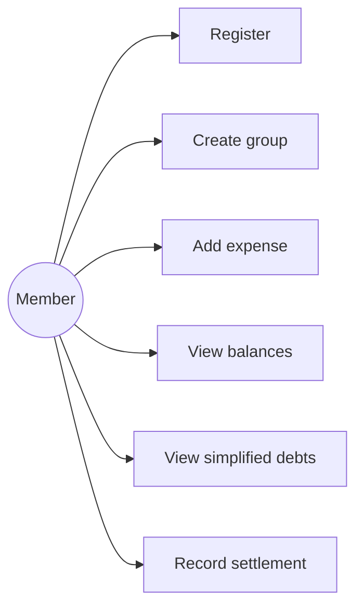

# Use Cases and User Stories

| ID | Use case | Preconditions | Main outcome |
|---|---|---|---|
| UC-01 | Register / login | Visitor has valid details | Authenticated session is issued |
| UC-02 | Create group | User is authenticated | Creator becomes group admin |
| UC-03 | Add expense | User is a group member | Valid splits total the amount |
| UC-04 | View balances | User is a group member | Computed net balances are shown |
| UC-05 | Simplify debts | Balances sum to zero | Deterministic suggested transfers are shown |
| UC-06 | Record settlement | Both users are members | Settlement affects computed balances |

## User stories

1. As a visitor, I want to register so that I can use the system.
2. As a member, I want to log in so that my groups are protected.
3. As a member, I want to create a group so that I can share costs.
4. As an admin, I want to add registered people so that they can participate.
5. As a member, I want to view my groups so that I can choose one quickly.
6. As a member, I want to add an equal split so that everyone pays fairly.
7. As a member, I want to add exact shares so that custom amounts are supported.
8. As a member, I want to add percentage shares so that ratios are supported.
9. As a member, I want paise rounding to be deterministic so that totals are exact.
10. As a member, I want to see expenses so that I can audit the group.
11. As a creator, I want to edit my expense so that mistakes can be corrected.
12. As an admin, I want to edit an expense so that the group data stays accurate.
13. As a member, I want to delete an erroneous expense.
14. As a member, I want net balances so that I know whether I owe money.
15. As a member, I want simplified debts so that fewer payments are needed.
16. As a member, I want to record a settlement so that balances update.
17. As a member, I want an activity feed so that group changes are visible.
18. As a member, I want dashboard totals so that I understand my overall position.

Acceptance criterion shared by expense stories: Given I am a group member, when I submit valid data, then the split shares sum exactly to the stored amount and the activity is recorded.
