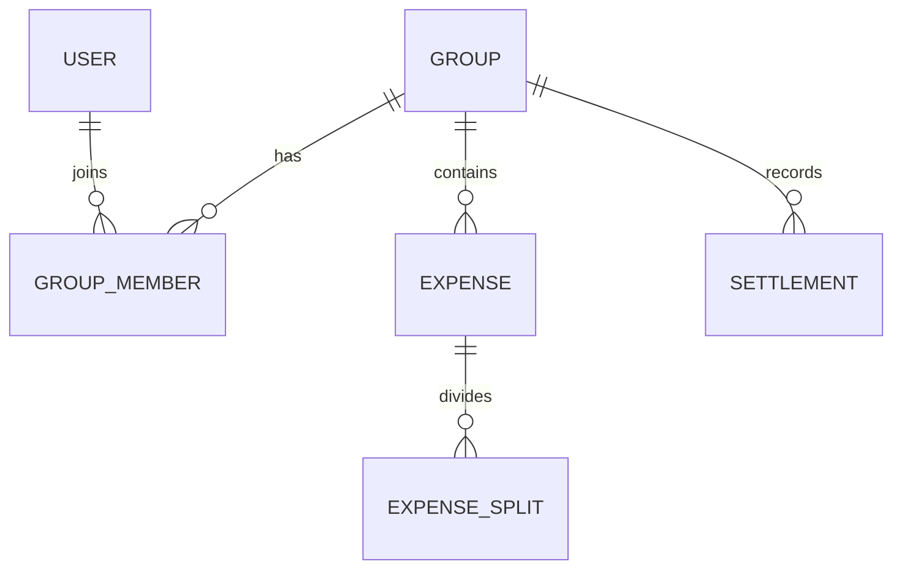

# Database Design

```mermaid
erDiagram
 USER ||--o{ GROUP_MEMBER : joins
 GROUP ||--o{ GROUP_MEMBER : has
 GROUP ||--o{ EXPENSE : contains
 EXPENSE ||--o{ EXPENSE_SPLIT : divides
 GROUP ||--o{ SETTLEMENT : records
```

Amounts are integer paise. ExpenseSplit normalizes per-person liability, while balances are calculated rather than stored.
