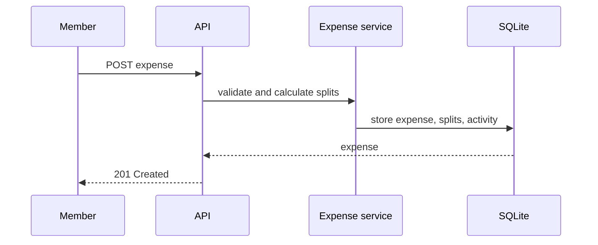
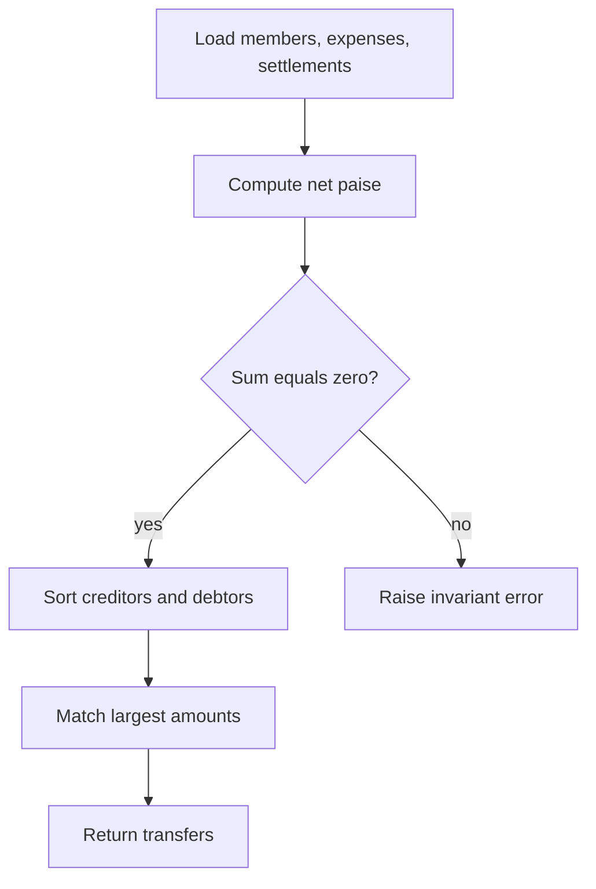
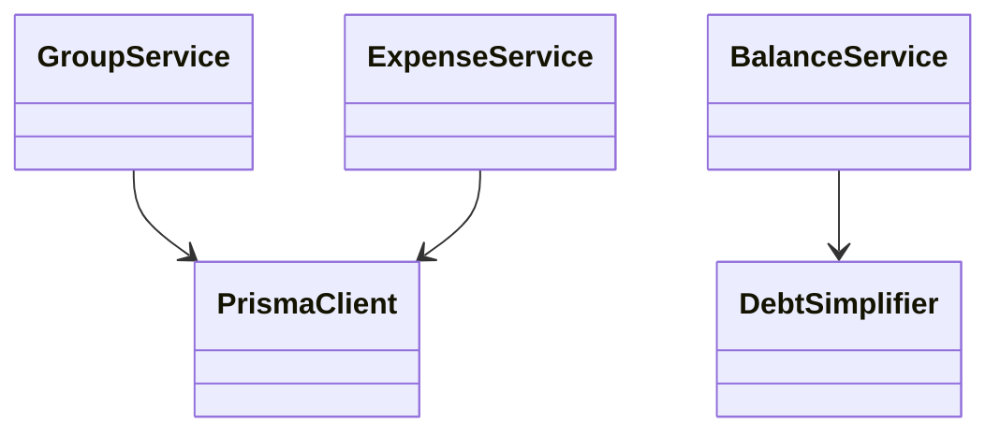

# UML Diagrams

## Add expense sequence

```mermaid
sequenceDiagram
 participant U as Member
 participant A as API
 participant S as Expense service
 participant D as SQLite
 U->>A: POST expense
 A->>S: validate and calculate splits
 S->>D: store expense, splits, activity
 D-->>A: expense
 A-->>U: 201 Created
```

## Balance activity

```mermaid
flowchart TD
 A[Load members, expenses, settlements] --> B[Compute net paise]
 B --> C{Sum equals zero?}
 C -->|yes| D[Sort creditors and debtors]
 D --> E[Match largest amounts]
 E --> F[Return transfers]
 C -->|no| G[Raise invariant error]
```

## Backend class view

```mermaid
classDiagram
 class GroupService
 class ExpenseService
 class BalanceService
 class DebtSimplifier
 GroupService --> PrismaClient
 ExpenseService --> PrismaClient
 BalanceService --> DebtSimplifier
```
