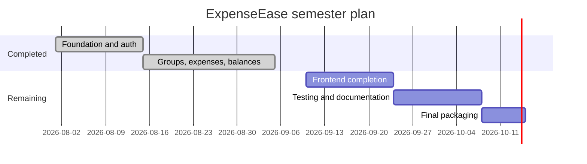

# Project Plan

Current status: backend foundation and one frontend end-to-end flow are implemented. Exact/percentage UI, settlement UI, API integration testing, full documentation, video, and packaging remain pending. Do not replace this status with a percentage unless the team confirms it.
