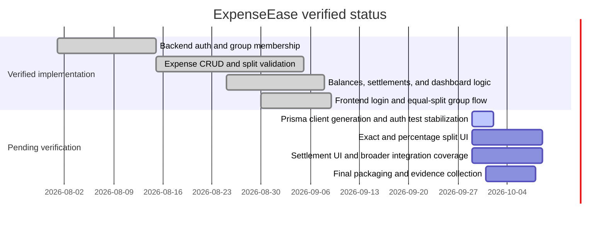

# Project Plan

Current status: the repository contains verified backend services and a working equal-split frontend flow. The repo also contains an outstanding auth test issue: the root `npm test` command currently fails because `@prisma/client` is not initialized. This must be resolved before final submission is considered complete. No percentage completion claim is recorded here because the team contribution record is still pending confirmation.
